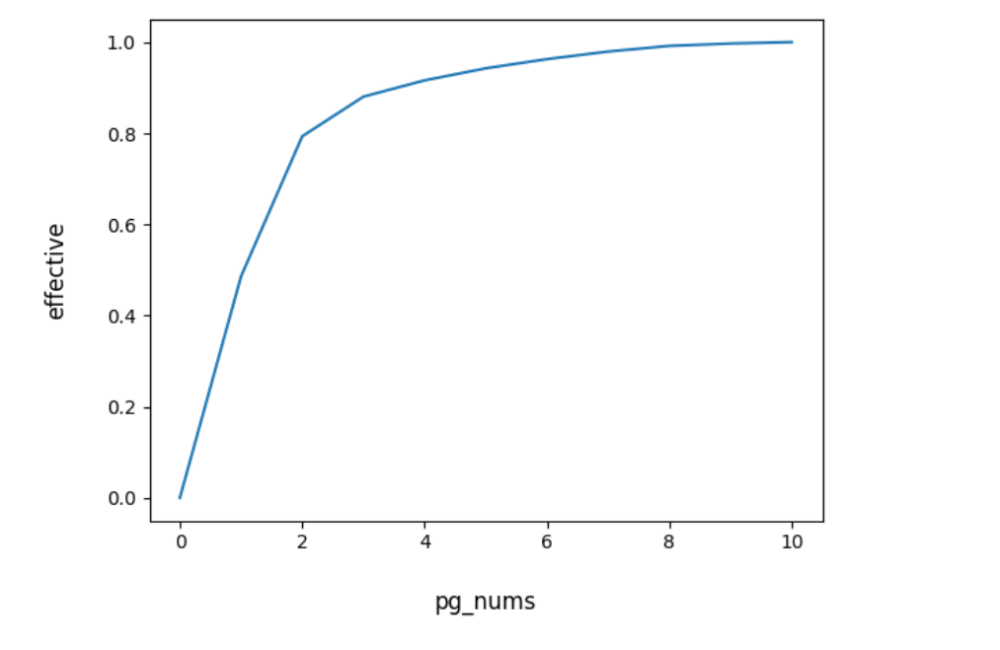
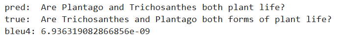

# 基于T5,BART,LLaMA-3的多跳问题生成
## 项目介绍
本项目主要是参加[华南师范大学第五届人工智能算法挑战赛](https://aistudio.baidu.com/competition/detail/1148/0/task-definition)过程中实现的几种方案，详细赛题信息及数据集可见上面链接。

#### 任务描述
给定若干个段落以及一个特定答案，这个答案与多个段落有关联。目标是生成一个多跳问题，这个问题的回答依赖于至少两个不同段落中的若干信息片段，并且其答案是给定的特定答案。

## 使用方法
在kaggle上运行相应的笔记本：
- [T5-MHQG](https://www.kaggle.com/code/czy111/mhqg-two-stage-training-t5)
- [BART-MHQG](https://www.kaggle.com/code/czy111/bart-qg)
- [LLaMA-3-8B-MHQG](https://www.kaggle.com/code/czy111/llama3-8b-mhqg)

另外提供LLaMA-3-8B在MHQG任务上的inference脚本：
- [LLaMA-3-8B-Inference](https://www.kaggle.com/code/czy111/llama3-8b-for-inference)

## 模型检查点
- [T5-base-MHQG-checkpoint](https://www.kaggle.com/datasets/czy111/t5-base-checkpoint5)
- [BART-large-MHQG-checkpoint](https://www.kaggle.com/datasets/czy111/bart-large-checkpoint2)
- [LLaMA-3-8B-MHQG-checkpoint](https://www.kaggle.com/datasets/czy111/llama-3-qg-checkpoint-1)

## 实现方案
### 1.数据清洗
在项目早期实验中发现：模型的**loss在训练过程中起伏较大**，训练较为不稳定。经过分析发现主要原因是数据集中有些**答案包含的信息较少，无法根据答案确定唯一的问题**。因此，在训练前对数据集进行清洗，将答案中包含信息较少的样本剔除，具体操作如下：
- 在微调T5和BART过程中，遵循以下两个启发式对数据进行清洗：
  - 如果答案出现在多于2个片段中，则删除。这一部分主要是一些年份、地点等。
  - 如果答案小于3个词，且不出现在任何段落中，则删除。这一部分主要是yes、no.
- 在微调LLaMA-3-8B过程中，由于实际训练的样本数量较少，故采用更严格的的清洗策略:
  - 对于答案长度为$len$的样本，被删除的概率为的概率$max(1-0.25*len,0)$

**在数据清洗后，T5和BART的微调数据剩余$56k$样本，LLaMA-3-8B的微调数据剩余$37k$样本。实验表明，模型训练的loss更加稳定，训练效果更好**。

### 2.数据处理
由于项目所用数据hotpotQA中，每个问题提供10个段落，其中8个为无效段落。**如果直接简单拼接十个段落，既会超出BART最大位置编码，也会浪费较多的计算资源**。因此，本项目采用以下方法对数据进行处理：
- 将每个段落与答案拼接，有效文本标签为1，无效文本标签为0，使用bert进行二分类。
- 训练好分类器后，使用分类器计算每个段落为有效文本的置信度，并把每个样本中的段落按置信度从大到小排序，然后拼接作为后续微调的输入。

在验证集上进行测试，发现**只需要取前3个文本就能覆盖88%的有效文本，取前七个文本能覆盖97%的有效文本**。在后续实验中，采用前7个作为输入。

### 3.模型训练设置
- T5，BART:
  - 最大输入长度设置为1024，
  - 批量大小为16（4次梯度累积）
  - Adafactor优化器，自适应学习率
  - 全参微调
  - 在56k数据上微调，训练2个epoch
- LLaMA-3-8B:
  - 最大输入长度设置为4096，
  - 批量大小为16（4次梯度累积）
  - AdamW优化器，学习率$2e-5$至$2e-4$
  - **LoRA微调**
  - 4bit量化
  - 在37k数据上微调,由于训练速度很慢，**实际仅在其中约5k数据上训练**。

## 实验结果
| 模型 | BertScore | BLEU4 | Score |
| :---: | :---: | :---: | :---: |
| T5-small (官方baseline) | 0.3535| 0.1519 | 25.26 |
| T5-base | 0.46664| 0.23145 | 34.90435 |
| BART-large | 0.46699|**0.2396**| 35.32937|
| LLaMA3-8B |**0.54885**| 0.18950| **36.91766**|

可以看到**三个模型微调结果均远优于baseline,其中LLaMA-3-8B表现最好**。值得注意的是，LLaMA-3-8B在BertScore表现很好，而BLEU4分数不高。这可能是BLEU4指标在衡量短文本时效果较差导致的，经常出现语义上完全正确，但BLEU4得分不高的情况，下面就是个例子：

			

